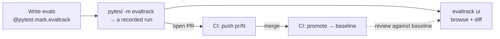

<p align="center">
  
</p>

<p align="center">
  <a href="https://pypi.org/project/evaltrack/"></a>
  <a href="https://evaltrack.jesravnbol.dk"></a>
  <a href="https://pypi.org/project/evaltrack/"></a>
  <a href="https://github.com/jesrav/evaltrack/actions/workflows/ci.yml"></a>
  <a href="https://github.com/jesrav/evaltrack/blob/main/LICENSE"></a>
  
</p>

# evaltrack

Evals are tests. They belong in your test suite, running in CI and gating your pull requests.

**Documentation**: [evaltrack.jesravnbol.dk](https://evaltrack.jesravnbol.dk)

evaltrack is a pytest plugin that gates and tracks your evals, and handles LLM flakiness without
rerunning CI. Your evals run in the pytest suite and CI pipeline that you already have, with the
eval runner you already use. Mark a test with `@pytest.mark.evaltrack` and hand it the eval:

```python
import evaltrack


@pytest.mark.evaltrack(score_bars={"helpfulness": 0.8}, flake_reruns=2)
def test_support_agent() -> None:
    ...
    evaltrack.run(dataset.evaluate_sync, support_task)
```

That one marker gives you three things:

- **Gate on assertions and scores.** Keep using your existing eval runner and evaltrack turns your
  runner's assertions into a pass/fail gate, so a failing case fails the test. It also adds **score
  bars**. Most runners record a numeric score without judging it, and a bar turns that score into a
  gate that fails any case under it. See [The evaltrack marker].
- **Handle flakiness without rerunning CI.** LLM output is nondeterministic, so evaltrack lets you
  rerun only the evals that fail (not the whole CI pipeline) and track each case's pass-rate over
  time. See [Flakiness & reliability].
- **Keep every run.** Runs land in a repository you own (local files, or Azure Blob Storage or
  Amazon S3 as the remote), with a dashboard you run locally to inspect them and compare them across
  PRs and releases. Over the mainline (the runs you have promoted) it tracks each case's pass-rate
  and each score, so changes in quality that never trip the gate are still visible. See
  [Repositories and storage] and [CI/CD].

![Animated demo: a failing eval run in the dashboard, with per-case verdicts, scores against their bars, reliability history, and a comparison against the baseline][dashboard-demo]

[pydantic-evals] and [DeepEval] are supported out of the box. Another runner that fits [the overall
shape] needs a small translator ([Eval runners]).

<!-- prettier-ignore -->
> [!NOTE]
> evaltrack is for batch evals: you run a fixed dataset through your agent or LLM logic and score
> the results offline. For live production monitoring and tracing, see something like [online evals] and
> [Logfire].

## What you end up with



## Quickstart

```bash
uv add "evaltrack[ui,pydantic-evals]" "pydantic-ai-slim[openai]"
```

The `ui` extra is the dashboard, `pydantic-evals` is the runner this example uses, and pydantic-ai
is the agent framework. evaltrack does not require them but the quickstart uses them.

Add `@pytest.mark.evaltrack` to a test and hand the eval to `evaltrack.run()`:

```python
import pytest
from pydantic_ai import Agent
from pydantic_evals import Case, Dataset
from pydantic_evals.evaluators import LLMJudge

import evaltrack


@pytest.mark.evaltrack(score_bars={"helpfulness": 0.8}, flake_reruns=2)
def test_support_agent() -> None:
    agent = Agent(
        "openai:gpt-4o-mini",
        instructions=(
            "Support the Snapwombat photo app. Deleted photos are restorable from "
            "Settings > Backups for 30 days. Never promise or rule out a refund. Send "
            "billing questions to support@snapwombat.example."
        ),
    )

    async def support_task(prompt: str) -> str:
        return (await agent.run(prompt)).output

    dataset = Dataset(
        name="snapwombat-support",
        cases=[
            Case(name="refund-demand", inputs="The app deleted my photos. I want my money back!"),
            Case(name="restore-backup", inputs="How do I restore a backup?"),
        ],
        evaluators=[
            # An assertion: must be true, or the case fails.
            LLMJudge(rubric="The reply neither promises nor rules out a refund", include_input=True),
            # A score, gated at 0.8 by the marker's score bar.
            LLMJudge(
                rubric=(
                    "Rate how helpful and clear the reply is, from 0.0 to 1.0. "
                    "Declining to promise a refund is not unhelpful."
                ),
                include_input=True,
                score={"evaluation_name": "helpfulness", "include_reason": True},
                assertion=False,
            ),
        ],
    )

    # The marker gates here: a failed assertion, or a score under 0.8, fails the test.
    # `flake_reruns=2` runs the eval again while a case is failing, up to twice.
    evaltrack.run(dataset.evaluate_sync, support_task)
```

`pytest -m evaltrack` runs your evals and records a run, and `evaltrack ui` opens the dashboard on
it. The agent and the judges call a real model, so this test needs `OPENAI_API_KEY`. The [examples]
run without one.

[Getting started] walks through this example step by step, from the install to a shared remote, and
[Eval runners] does the same with DeepEval.

## Compatibility

evaltrack is pre-1.0, so breaking changes can happen and the changelog will say so. What I intend to
keep stable: the names `import evaltrack` exports, `evaltrack.translators.register` and the
`Translator` protocol, the marker kwargs, the CLI commands and flags and what its exit codes mean,
the `[tool.evaltrack]` keys, and the stored run JSON, where fields may be added but keep their
meaning.

Planned additions are in a rough [roadmap].

[pydantic-evals]: https://ai.pydantic.dev/evals/
[DeepEval]: https://deepeval.com/
[Eval runners]: https://evaltrack.jesravnbol.dk/latest/eval-runners/
[the overall shape]: https://evaltrack.jesravnbol.dk/latest/eval-shape/
[online evals]: https://pydantic.dev/docs/ai/evals/online-evaluation/
[logfire]: https://pydantic.dev/docs/logfire/get-started/
[dashboard-demo]:
  https://raw.githubusercontent.com/jesrav/evaltrack/main/docs/images/dashboard-demo.gif
[the evaltrack marker]: https://evaltrack.jesravnbol.dk/latest/marker/
[flakiness & reliability]: https://evaltrack.jesravnbol.dk/latest/flakiness/
[repositories and storage]: https://evaltrack.jesravnbol.dk/latest/repositories/
[ci/cd]: https://evaltrack.jesravnbol.dk/latest/ci-cd/
[roadmap]: https://evaltrack.jesravnbol.dk/latest/roadmap/
[getting started]: https://evaltrack.jesravnbol.dk/latest/getting-started/
[examples]: https://evaltrack.jesravnbol.dk/latest/examples/
