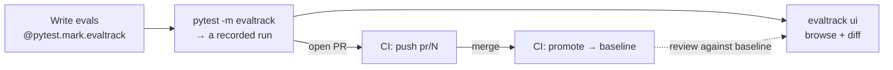

<p align="center">
  
</p>

<p align="center">
  <a href="https://pypi.org/project/evaltrack/"></a>
  <a href="https://pypi.org/project/evaltrack/"></a>
  <a href="https://github.com/jesrav/evaltrack/actions/workflows/ci.yml"></a>
  <a href="https://github.com/jesrav/evaltrack/blob/main/LICENSE"></a>
  
</p>

# evaltrack

Evals are tests. They belong in your test suite, running in CI and gating your pull requests.

evaltrack is a pytest plugin that records, gates and tracks your evals. Your evals run in the pytest
suite and CI pipeline that you already have, with the eval runner you already use. Mark a test with
`@pytest.mark.evaltrack` and you get two things:

- **Gate on assertions and scores.** Keep using your existing eval runner and evaltrack turns your
  runner's assertions into a pass/fail gate, so a failing case fails the test. It also adds **score
  bars**. Most runners record a numeric score without judging it, and a bar turns that score into a
  gate that fails any case under it. See [The evaltrack marker].
- **Handle flakiness without rerunning CI.** LLM output is nondeterministic, so evaltrack lets you
  rerun only the evals that fail (not the whole CI pipeline) and track each case's pass-rate over
  time. See [Flakiness & reliability].

evaltrack records every run in a repository you own (local files, or Azure Blob Storage or Amazon S3
as the remote), with a dashboard you run locally to inspect runs and compare them across PRs and
releases. Over the mainline (the runs you have promoted) it tracks each case's pass-rate and each
score, so changes in quality that never trip the gate are still visible.

![Animated demo: a failing eval run in the dashboard, with per-case verdicts, scores against their bars, reliability history, and a comparison against the baseline][dashboard-demo]

[pydantic-evals] and [DeepEval] are supported out of the box. Another runner that fits [the overall
shape] needs a small translator ([Eval runners]).

<!-- prettier-ignore -->
> [!NOTE]
> evaltrack is for batch evals: you run a fixed dataset through your agent or LLM logic and score
> the results offline. For live production monitoring and tracing, see something like [online evals] and
> [Logfire].

## What you end up with



## Getting Started

The quickstart below uses pydantic-evals. If you are new to it, [start here]. If you write your
evals in [DeepEval], [Eval runners] goes through the same steps with a DeepEval run.

### 1. Install

```bash
# The quick start uses pydantic-evals as the eval runner and evaluates an agent built in pydantic-ai, but neither is required for evaltrack.
uv add "evaltrack[ui,pydantic-evals]" "pydantic-ai-slim[openai]"
# or
pip install "evaltrack[ui,pydantic-evals]" "pydantic-ai-slim[openai]"
```

<!-- prettier-ignore -->
> [!NOTE]
> Linux and macOS are supported, on Python 3.11 to 3.14.
> If your machine runs Windows, run evaltrack under WSL2.

### 2. Write a tracked eval

Add `@pytest.mark.evaltrack` to a test and hand the eval to `evaltrack.run()`. The test below is
sync. For an async test, use `await evaltrack.run_async(dataset.evaluate, task)` with your async
plugin.

```python
import pytest
from pydantic_ai import Agent
from pydantic_evals import Case, Dataset
from pydantic_evals.evaluators import LLMJudge

import evaltrack


@pytest.mark.evaltrack(score_bars={"helpfulness": 0.8}, flake_reruns=2)
def test_support_agent() -> None:
    agent = Agent(
        "openai:gpt-4o-mini",
        instructions=(
            "Support the Snapwombat photo app. Deleted photos are restorable from "
            "Settings > Backups for 30 days. Never promise or rule out a refund. Send "
            "billing questions to support@snapwombat.example."
        ),
    )

    async def support_task(prompt: str) -> str:
        return (await agent.run(prompt)).output

    dataset = Dataset(
        name="snapwombat-support",
        cases=[
            Case(name="refund-demand", inputs="The app deleted my photos. I want my money back!"),
            Case(name="restore-backup", inputs="How do I restore a backup?"),
        ],
        evaluators=[
            # An assertion: must be true, or the case fails.
            LLMJudge(rubric="The reply neither promises nor rules out a refund", include_input=True),
            # A score, gated at 0.8 by the marker's score bar.
            LLMJudge(
                rubric=(
                    "Rate how helpful and clear the reply is, from 0.0 to 1.0. "
                    "Declining to promise a refund is not unhelpful."
                ),
                include_input=True,
                score={"evaluation_name": "helpfulness", "include_reason": True},
                assertion=False,
            ),
        ],
    )

    # The marker gates here: a failed assertion, or a score under 0.8, fails the test.
    # `flake_reruns=2` runs the eval again while a case is failing, up to twice.
    evaltrack.run(dataset.evaluate_sync, support_task)
```

The agent and the two LLM judges all call a real model, so this test needs an API key (here
`OPENAI_API_KEY`). The [examples] run without one — [`test_05_llm_judge.py`][llm judge example] is
the same pattern, an `LLMJudge` guardrail plus a `score_bars`-gated score, with the model and the
judge scripted.

<!-- prettier-ignore -->
> [!IMPORTANT]
> One test needs to be one eval. evaltrack records one eval per test, whichever runner produced it,
> and the test's name identifies that eval everywhere. If you want two evals, write two tests.

### 3. Run it

`evaltrack` is a registered pytest marker. You can select only your evals:

```bash
pytest -m "evaltrack"
```

Each pytest session produces a **run**, a snapshot of all recorded eval results, saved to
`.evaltrack/` by default (add `.evaltrack/` to your project's `.gitignore`).

CI can run the same command. See [CI/CD].

### 4. See the results

```bash
evaltrack ui
```

This serves the dashboard at `http://127.0.0.1:8765` and prints the link. Browse scores and
pass-rates per case, and diff any two runs. Open a case to see each score against its bar and its
history over the mainline. `evaltrack report` writes the same view of one run as a single HTML file
that opens anywhere, for a CI artifact or a release note ([CLI › report]).

<!-- prettier-ignore -->
> [!NOTE]
> The dashboard's React frontend is beta, written largely by AI coding agents. The security notes
> are in the [security policy].

### 5. Track a shared remote (optional)

Declare your repositories in `pyproject.toml`. `local` is where the plugin saves runs. `remote` is a
shared repository that your CI writes to (Azure Blob Storage or Amazon S3). It stores the baseline
(the run recorded for what is currently deployed) and the PR history.

```toml
[tool.evaltrack]
local  = "./.evaltrack"
remote = "azure://account/evals"
```

`evaltrack ui` then mounts both and opens on your latest local run. Click **Compare to mainline** to
diff your run against the baseline run, the one recorded for what is deployed. See [Repositories and
storage][configuring repositories] for the full setup.

---

## Documentation

Guides:

- [The shape of an eval]: cases, evaluators, results, attempts, rounds and runs.
- [The evaltrack marker]: the gate, score bars, exceptions, xfail.
- [Flakiness & reliability]: `flake_reruns`, `repeats`, cross-run pass-rates, when to bump
  `eval_version`.
- [Eval runners]: using pydantic-evals and DeepEval, and connecting another runner ([Translators]).
- [Repositories and storage]: the run/ref/baseline model, where runs are stored, cleaning up, and
  reading runs from Python.
- [CI/CD]: recording a run per PR, promoting on merge, and what CI has to get right.
- [Examples]: runnable evals that you can copy.

Reference: [CLI] and [Configuration].

Design note: [the dashboard's trust model][dashboard trust model].

## Compatibility

evaltrack is pre-1.0, so breaking changes can happen and the changelog will say so. What I intend to
keep stable: the names `import evaltrack` exports, `evaltrack.translators.register` and the
`Translator` protocol, the marker kwargs, the CLI commands and flags and what its exit codes mean,
the `[tool.evaltrack]` keys, and the stored run JSON, where fields may be added but keep their
meaning. `raw_results` is the exception, since the runner decides its shape.

Planned additions are in a rough [roadmap].

[pydantic-evals]: https://ai.pydantic.dev/evals/
[DeepEval]: https://deepeval.com/
[Eval runners]: https://github.com/jesrav/evaltrack/blob/main/docs/eval-runners.md
[the overall shape]: https://github.com/jesrav/evaltrack/blob/main/docs/eval-shape.md
[translators]: https://github.com/jesrav/evaltrack/blob/main/docs/translators.md
[start here]: https://ai.pydantic.dev/evals/
[online evals]: https://pydantic.dev/docs/ai/evals/online-evaluation/
[logfire]: https://pydantic.dev/docs/logfire/get-started/
[cli › report]: https://github.com/jesrav/evaltrack/blob/main/docs/cli.md#evaltrack-report
[dashboard-demo]:
  https://raw.githubusercontent.com/jesrav/evaltrack/main/docs/images/dashboard-demo.gif
[the evaltrack marker]: https://github.com/jesrav/evaltrack/blob/main/docs/marker.md
[the shape of an eval]: https://github.com/jesrav/evaltrack/blob/main/docs/eval-shape.md
[flakiness & reliability]: https://github.com/jesrav/evaltrack/blob/main/docs/flakiness.md
[configuring repositories]:
  https://github.com/jesrav/evaltrack/blob/main/docs/repositories.md#configuring-repositories
[repositories and storage]: https://github.com/jesrav/evaltrack/blob/main/docs/repositories.md
[examples]: https://github.com/jesrav/evaltrack/blob/main/examples/README.md
[llm judge example]: https://github.com/jesrav/evaltrack/blob/main/examples/test_05_llm_judge.py
[ci/cd]: https://github.com/jesrav/evaltrack/blob/main/docs/ci-cd.md
[cli]: https://github.com/jesrav/evaltrack/blob/main/docs/cli.md
[configuration]: https://github.com/jesrav/evaltrack/blob/main/docs/configuration.md
[security policy]: https://github.com/jesrav/evaltrack/blob/main/SECURITY.md
[dashboard trust model]:
  https://github.com/jesrav/evaltrack/blob/main/SECURITY.md#dashboard-trust-model
[roadmap]: https://github.com/jesrav/evaltrack/blob/main/ROADMAP.md
