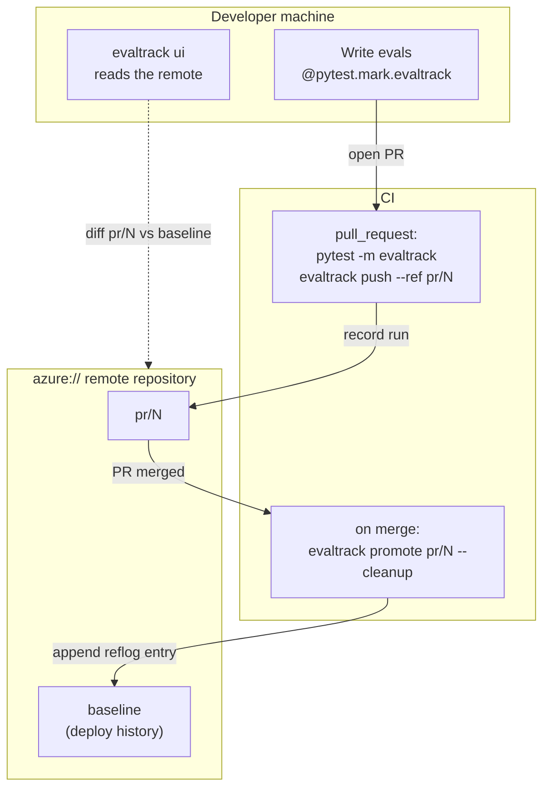
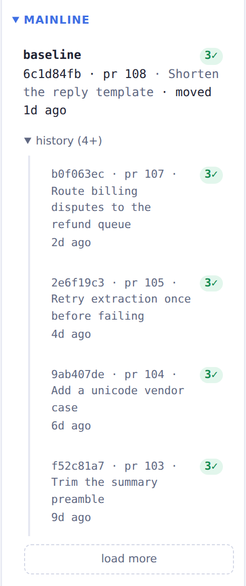
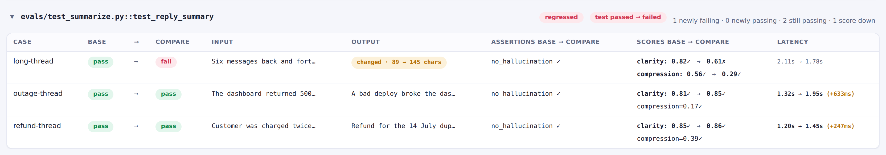

# CI/CD

Your evals are pytest tests, so the CI you already have runs them. This is how to wire the evaltrack
CLI into it. Every pull request records a run and pushes it to a shared repository, and a merge
promotes that run to [`baseline`]. The examples use an `azure://` remote, but not a concrete CI
system. The commands are the same wherever you run them. Promote-on-merge is a convention here, not
a rule of the tool. If a merge is not the moment code ships in your process (for example if you use
GitOps), see [Adapting the flow].

## The flow



## Prerequisites

You need a shared `azure://` remote and credentials for it:

- For the URL shape and how evaltrack authenticates, see [Repositories › Azure Blob Storage].
- Point `[tool.evaltrack].remote` at the remote, so `evaltrack ui` mounts it next to your local
  runs:

  ```toml
  [tool.evaltrack]
  local  = "./.evaltrack"
  remote = "azure://account/evals"
  ```

- Put `AZURE_CLIENT_ID`, `AZURE_TENANT_ID` and `AZURE_CLIENT_SECRET` in your CI's secret store,
  where `DefaultAzureCredential` reads them, along with whatever the evals themselves need (an
  `OPENAI_API_KEY`, say).

## PR pipeline

Run the evals, write a run file, and push it under `pr/{n}`:

```bash
# The run records these. A CI checkout is usually a shallow clone on a detached
# HEAD, so the git context evaltrack would read is not the one you want.
export EVALTRACK_COMMIT="$COMMIT_SHA"
export EVALTRACK_BRANCH="$BRANCH_NAME"

pytest -m evaltrack --evaltrack-run-file run.json

# --commit records the same SHA on the ref's reflog entry, next to the PR.
evaltrack push --run-file run.json \
  --ref "pr/$PR_NUMBER" \
  --pr "$PR_NUMBER" \
  --title "$PR_TITLE" \
  --commit "$COMMIT_SHA"
```

That is the whole integration. What the job around it has to get right:

- **Install `evaltrack[azure]`** alongside your project's own dependencies, or the push fails.
- **Name the remote once.** Set `EVALTRACK_REMOTE` for the job and neither command needs to name a
  repository (see [Configuration › Precedence rules](./configuration.md#precedence-rules)).
- **Push even when an eval failed.** The run is written when the pytest session finishes, whatever
  the verdicts, so guard the push on the file existing rather than on the test step passing. The run
  you most need in the dashboard is the one that caught a regression.
- **Do not run the eval step under [pytest-xdist]** (`-n`). evaltrack does not support it and fails
  every marked test.
- **Override the git context**, as above, or the run records no commit. See
  [Configuration › Environment variables](./configuration.md#environment-variables).

`--pr` and `--title` record the PR number and title on the ref, so the dashboard shows which PR a
ref represents. With `pr_url_template` set, it links the number to the PR.

## Promote pipeline

When the PR merges, point `baseline` at its run:

```bash
evaltrack promote "pr/$PR_NUMBER" --commit "$MERGE_COMMIT_SHA" --cleanup
```

- `--cleanup` deletes the merged `pr/{n}` ref and the runs in its history that no other ref reaches,
  so the PR stops showing as open in the dashboard.
- Run one job at a time per PR, and one promote at a time. Both write refs, and `--cleanup` works
  out what to delete before deleting it. A concurrent writer can leave `pr/{n}` on an older commit's
  run, or lose a run it had just referenced.

A promote onto the run `baseline` already points at records nothing, so a retried job is safe. See
[Moving a ref is idempotent](./repositories.md#moving-a-ref-is-idempotent).

The baseline reflog reads as a timeline of promoted runs:



## Adapting the flow to your delivery process

`baseline` is the run you compare against. `promote` is a plain CLI call, so run it at whatever
event means shipped in your process. I promote on merge, which suits trunk-based development.

Promoting later than merge leaves `pr/{n}` refs standing until their run ships, and a ref reaches
every run in its history. Delete them once their PR is closed.

A repository has one `baseline`. The dashboard's Mainline section and the [cross-run reliability
estimate][cross-run reliability] read it.

## Reviewing a PR

The PR's run is in the shared remote, so a reviewer can see its evals without checking the branch
out. `evaltrack ui` lists each PR run under **Pull requests**. Pick one as the compare run against
`baseline` to see which cases changed.



## Flaky evals in CI

Give nondeterministic evals a `flake_reruns` budget on the marker. A flaky case then does not fail
the PR. See [Flakiness & reliability](./flakiness.md).

Prefer `flake_reruns` over a rerun of a red CI job. A job rerun discards the failed attempts and
biases the [tracked pass-rate][cross-run reliability] upward.

---

**Related:** [CLI](./cli.md) · [Repositories and storage](./repositories.md) ·
[Flakiness & reliability](./flakiness.md)

[`baseline`]: ./repositories.md#baseline-and-mainline
[adapting the flow]: #adapting-the-flow-to-your-delivery-process
[repositories › azure blob storage]: ./repositories.md#azure-blob-storage
[pytest-xdist]: https://github.com/pytest-dev/pytest-xdist
[cross-run reliability]: ./flakiness.md#cross-run-reliability
