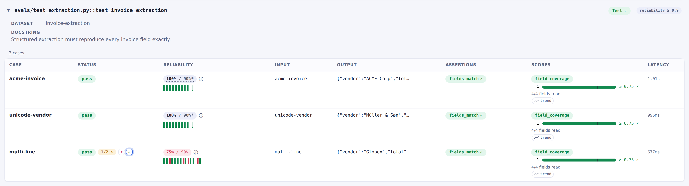
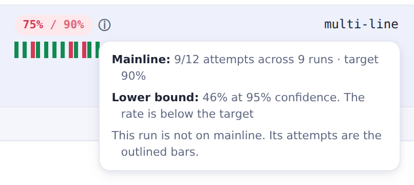

# Flakiness & reliability

LLM and agent evals are nondeterministic. The same [case] can pass most runs but fail once in a
while. evaltrack separates two concerns that a single pass/fail cannot tell apart:

- **Correctness**: does an attempt pass _right now_? Assertions and score bars decide it, and
  [the marker](./marker.md#what-counts-as-passing) enforces it strictly on every run.
- **Reliability**: does it pass _consistently_ across runs, over time? This is a dashboard signal,
  pooled over many runs and never enforced in a test.

You can handle nondeterminism in two directions, and the marker has a setting for each:

| setting          | direction                                            |
| ---------------- | ---------------------------------------------------- |
| `flake_reruns=N` | absorb: retry a failing case, and one pass is enough |
| `repeats=N`      | demand: every case runs N times and all N must pass  |

They contradict each other, so a test sets one or the other. This page covers both, and
`reliability_target` / `eval_version` (track the pass-rate across runs). The full kwarg reference is
in [Configuration], with an example.

## Rerun-on-failure: `flake_reruns`

`flake_reruns=N` runs the eval again while any case is still failing, up to `N` extra rounds,
stopping as soon as every case has passed. A round is one pass over the whole eval, and each round
gives every case it runs one more attempt. A case that has already passed is settled. A later round
cannot un-pass it.

A rerun here is another round of the eval inside the same test, not pytest running the test again.

```python
@pytest.mark.evaltrack(flake_reruns=2)  # (1)!
async def test_addition(my_agent_task) -> None:
    dataset = Dataset(
        name="addition",
        cases=[Case(name="3+5", inputs="What is 3 + 5?")],  # (2)!
        evaluators=[Contains("8")],
    )
    await evaltrack.run_async(dataset.evaluate, my_agent_task)
```

1. Run the eval up to two extra times while a case is failing. The test passes if all cases pass.
2. Name every case. A rerun is matched to the attempt it retries by case id.

What a rerun does and does not cover:

- **Only a _verdict_ failure gets a rerun.** An exception (a bug in your code or eval, or an
  unstable service such as an LLM API) errors the test immediately. Flake reruns absorb the
  randomness of LLM or agent output, not errors. Retry a transient API error inside the eval, where
  the call is made.
- The rounds happen within one test invocation, so fixtures are not re-created per retry.
- Keep the budget small. With a high one, a case can fail most of its attempts and still pass the
  test. You then see the drop only as a falling pass-rate in the dashboard, never as a failing test.
- A plugin that reruns a whole failed test, such as pytest-rerunfailures, is refused. Its second run
  is a second eval of that test, which cannot be folded into the first.

A rerun keeps a flaky case from failing the test, but the flakiness stays visible. Every attempt is
recorded. The dashboard pools them into the case's pass-rate across runs
([Cross-run reliability](#cross-run-reliability)), so a case that keeps needing a rerun shows up
there. In the run view, a rerun case keeps every attempt, not just the one that decided it:



## Demanding consistency: `repeats`

`repeats=N` points the other way: every case needs N attempts and all N must pass. A case that
succeeds four times out of five fails the test. Use it where one lucky pass is not good enough.

The attempts can come from the eval itself. pydantic-evals' `evaluate(repeat=N)` produces all N in
one call, which keeps the runner's own parallelism. An eval that runs each case once is run N times
instead, one round after another.

Read the count off the marker, so it is written once:

```python
# pydantic-evals: evaluate_sync takes the count as repeat=.
@pytest.mark.evaltrack(repeats=5)
def test_my_eval():
    evaltrack.run(dataset.evaluate_sync, task, repeat=evaltrack.repeats())
```

`evaltrack.repeats()` returns 1 when the marker demands nothing, so the same eval body works with or
without repetition.

## Cross-run reliability

When you set `reliability_target`, the dashboard pools a case's attempts from the recent mainline
runs, compares that pass-rate to the target, and shows a commit-annotated trend. It answers "is this
eval as stable as I expect over time". An errored attempt never feeds the rate. An exception errors
the test, and it is not a flakiness sample.



### Which runs pool

The pooled runs are the **mainline**, the runs [`baseline`][baseline] has pointed at, in a window of
the 50 most recent entries in its [reflog](./repositories.md#ref). Runs from assorted PR tips and
local branches do not pool.

The pooled rate is always the mainline's (your deploy history). The run you view (a PR run or a
local run) is _not_ folded into it, so the number keeps its meaning of "how reliable is this eval on
mainline". Its own attempts are still drawn on the trend, set apart from the pooled ones.

### What the rate means

The pooled rate is the pass-rate of the promoted runs, not of every attempt. Under the
[CI flow](./ci-cd.md#the-flow) a failed pipeline run does not merge, so the pool holds only runs
that passed the gate. Without `flake_reruns`, every pooled attempt passed, so the rate reads 100%
whatever the truth. With `flake_reruns`, failed attempts inside a passing run still count, so the
rate is close when the budget fits the case and optimistic when it does not.

A rate on its own also says nothing about the sample size: 8/8 and 800/800 both read 100%. The ⓘ
beside the chip gives the sample size and the lower bound of its 95% Wilson interval.

### Segmenting, and when to bump `eval_version`

A pooled pass-rate is valid only while the eval is unchanged, so the manual `eval_version` label
segments the history. Bump it whenever you change anything that could move the result: the case, the
evaluators, the bars, the judge, or the system under test. A bump starts a fresh segment, and the
pre-change runs no longer pool with the new ones. `eval_version` is set per test, and a bump
segments every case in that test's eval at once.

History is also keyed by the case id, the name you gave it. Give every case one
([case ids](./translators.md#case-ids)).

---

**Related:** [The evaltrack marker](./marker.md) · [CI/CD](./ci-cd.md)

[configuration]: ./configuration.md#marker-keyword-arguments
[case]: ./eval-shape.md
[baseline]: ./repositories.md#baseline-and-mainline
