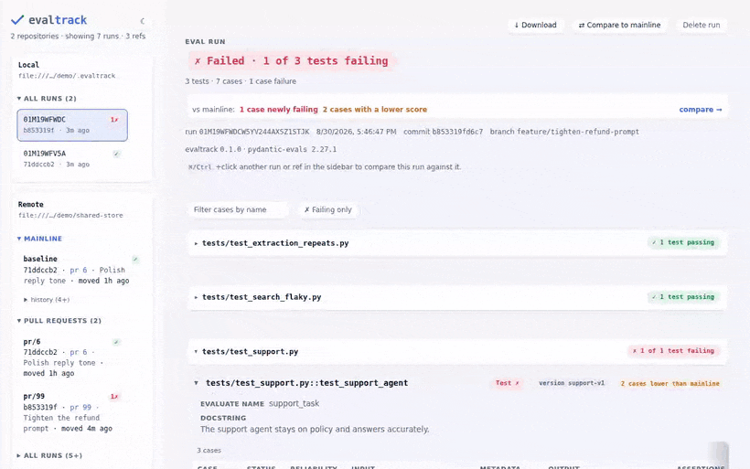
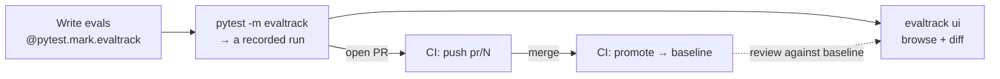

# evaltrack

Evals are tests. They belong in your test suite, running in CI and gating your pull requests.

evaltrack is a pytest plugin that records, gates and tracks your evals. Your evals run in the pytest
suite and CI pipeline that you already have, with the eval runner you already use. Mark a test with
`@pytest.mark.evaltrack` and hand it the eval:

```python
import evaltrack


@pytest.mark.evaltrack(score_bars={"helpfulness": 0.8}, flake_reruns=2)  # (1)!
def test_support_agent() -> None:
    ...
    evaltrack.run(dataset.evaluate_sync, support_task)  # (2)!
```

1. The marker makes the test an eval. `score_bars` gates the `helpfulness` score at 0.8, and
   `flake_reruns=2` reruns the eval up to twice while a case is failing.
2. Hands the eval to evaltrack, here a pydantic-evals dataset and the task it evaluates. Every round
   is recorded, and a failed assertion or a score under its bar fails the test.

That one marker gives you three things:

- **Gate on assertions and scores.** evaltrack turns your runner's assertions into a pass/fail gate,
  so a failing case fails the test. Score bars turn a numeric score into a gate too. See
  [The evaltrack marker](./marker.md).
- **Handle flakiness without rerunning CI.** LLM output is nondeterministic, so evaltrack reruns
  only the evals that fail and tracks each case's pass-rate over time. See
  [Flakiness & reliability](./flakiness.md).
- **Keep every run.** Runs land in a repository you own, local files or Azure Blob Storage or Amazon
  S3, with a dashboard you run locally to inspect them and compare them across PRs and releases. See
  [Repositories and storage](./repositories.md) and [CI/CD](./ci-cd.md).



[pydantic-evals](https://ai.pydantic.dev/evals/) and [DeepEval](https://deepeval.com/) are supported
out of the box. Another runner that fits [the shape of an eval](./eval-shape.md) needs a small
translator. See [Eval runners](./eval-runners.md) and [Translators](./translators.md).

!!! note

    evaltrack is for batch evals: you run a fixed dataset through your agent or LLM logic and score
    the results offline. For live production monitoring and tracing, see something like
    [online evals](https://pydantic.dev/docs/ai/evals/online-evaluation/) and
    [Logfire](https://pydantic.dev/docs/logfire/get-started/).

## What you end up with



## Install

```bash
uv add evaltrack
# or
pip install evaltrack
```

Add the `ui` extra for the dashboard, and the `azure` or `s3` extra for a
[shared remote](./repositories.md#backends). Then install the runner you write your evals in,
pydantic-evals or DeepEval. See [Eval runners](./eval-runners.md).

Linux and macOS are supported, on Python 3.11 to 3.14. [Getting started](./getting-started.md) walks
through a first eval, from the marker to the dashboard.

## Where to go next

- [Getting started](./getting-started.md): install, write a tracked eval, run it, see the results.
- [The shape of an eval](./eval-shape.md): cases, evaluators, results, attempts, rounds and runs.
- [The evaltrack marker](./marker.md): the gate, score bars, exceptions, xfail.
- [Flakiness & reliability](./flakiness.md): `flake_reruns`, `repeats`, cross-run pass-rates, when
  to bump `eval_version`.
- [Eval runners](./eval-runners.md): using pydantic-evals and DeepEval, and connecting another
  runner.
- [Repositories and storage](./repositories.md): the run/ref/baseline model, where runs are stored,
  cleaning up, and reading runs from Python.
- [CI/CD](./ci-cd.md): recording a run per PR, promoting on merge, and what CI has to get right.
- [Examples](./examples.md): runnable evals that you can copy.

Reference: [CLI](./cli.md), [Configuration](./configuration.md) and the
[API reference](./reference/api.md).
